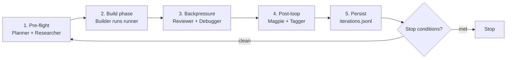

<div align="center">


# Ralpharium

### *The Ralph Loop, made observable.*

A local-first control plane for autonomous AI coding loops — **Claude · Codex · Aider · any shell command** — with **8 specialized agents in shared memory**, a live dashboard, and replayable iteration history.

<p>
  <a href="https://x.com/Ralphaxyz" target="_blank">
    
  </a>
  &nbsp;
  <a href="https://www.npmjs.com/package/ralpharium" target="_blank">
    
  </a>
  &nbsp;
  <a href="https://ralpharium.xyz" target="_blank">
    
  </a>
</p>

<p>
  
  
  
  
  
  
</p>

</div>

CA: 0x7280415E32a94Bc7adaa00d480Ee4E7fB6e73F0e

---

## ⚡ Quickstart

```bash
npx ralpharium init     # scaffold the four Ralph artifacts in your repo
npx ralpharium start    # boot the daemon, opens dashboard at localhost:3000
```

**Two commands.** No accounts, no API keys, no cloud calls. Real Claude / Codex / Aider iterations need those CLIs installed and authenticated separately — Ralpharium just orchestrates them locally.

---

## 🩻 Requirements

| | What | Why | Check |
|---|---|---|---|
|  | Node 18+ | comes with `npx` | `node -v` |
|  | Python 3.11+ | the daemon is FastAPI | `python --version` |

If Python is missing, grab it from [python.org](https://www.python.org/downloads/) (Windows / macOS), `brew install python@3.12`, or `sudo apt install python3.12 python3-pip`. Already installed but Ralpharium can't find it? Set `RALPH_PYTHON` to the full path.

> **FastAPI and uvicorn auto-install on first run** — you don't have to do anything.

---

## 🍩 What is it?

Ralpharium is a **local-first dashboard and runner** that turns the [Ralph Wiggum technique](https://ghuntley.com/ralph/) (a bash loop that pipes a prompt file to an AI CLI on repeat) into an observable, controllable system.

You point it at a repo, pick a runner, click **Start**. It runs the AI in a tight cycle, gates each pass on tests + lint, and shows you exactly what changed — every iteration, every commit, every failure — without anything leaving your machine.

> **Not** a replacement for Claude / Codex / Aider. It *runs* them. The runner is the AI; Ralpharium provides the **context, validation, observation, and stop conditions** around it.

### What you get

| | Surface | What lives there |
|---|---|---|
| 🎛️ | **`/dashboard`** | Operator console — iteration timeline, plan health, validation backpressure, spec coverage, guardrails, runtime panel. Start / pause / panic-stop. |
| 🔬 | **`/ram`** | Live debug view — 8 agents grid with drill-down, blackboard slots, event ring buffer, hex viewer of the shared-memory segment, scratchpad, checkpoints, runner process monitor. |
| 🏛️ | **`/tech`** | Architecture diagrams + design notes. |
| 🔄 | **Continuous-loop runner** | Stop conditions: max iterations, on failure, no commit, dirty tree. |
| 📜 | **`.ralph/iterations.jsonl`** | Append-only replayable history of every loop pass. |
| ⚙️ | **`ralpharium` CLI** | Init, environment checks, page launchers. |

---

## 📺 Inside an iteration

A single iteration = one full pass of the 8-agent cycle. The daemon orchestrates it; the dashboard streams every step over WebSocket.



| # | Phase | Agents | What happens |
|---|---|---|---|
| 1 | **Pre-flight** | `planner` + `researcher` | Planner reads `IMPLEMENTATION_PLAN.md` and picks the next unchecked task. Researcher scans the repo (branch, dirty state, spec count) and writes context to the shared blackboard. |
| 2 | **Build** | `builder` | Spawns your runner (`claude -p "$(cat PROMPT.md)"`) with `cwd=your repo`. Stdout streams line-by-line into the RAM event log. Blackboard slots update in real time. |
| 3 | **Backpressure** | `reviewer` + `debugger` | Reviewer runs validation gates (`npm test` / `lint` / `typecheck` / `build`) auto-detected from `package.json`. If anything fails, Debugger classifies the failure. |
| 4 | **Post-loop** | `magpie` + `tagger` | If the iteration produced a commit, Magpie collects the artifacts. Tagger classifies the iteration (feature / fix / refactor / docs). |
| 5 | **Persist** | — | Full record appended to `.ralph/iterations.jsonl`. WebSocket broadcasts a fresh snapshot — every open tab updates without refresh. |
| 6 | **Loop or stop** | — | Stop conditions: max iterations, panic, dirty tree, no commit, validation failed. Thrash detector pauses on "same files modified with same error 3+ times". |

---

## 👥 The 8 agents

| Agent | Phase | Role |
|---|---|---|
| 🧾 `spec_writer` | phase-1 | Turn rough requirements into `specs/*.md` the runner can read |
| 🔍 `researcher` | phase-1 | Investigate the repo before plan/build — surface relevant code, prior decisions |
| 🗺️ `planner` | build | Pick the next task from `IMPLEMENTATION_PLAN.md` and frame the iteration prompt |
| 🔨 `builder` | build | Execute the runner subprocess (Claude / Codex / Aider) — the hands of the loop |
| 🧪 `reviewer` | backpressure | Run validation gates — tests, lint, typecheck, build — surface what broke |
| 🐛 `debugger` | backpressure | When validation fails, classify the failure so the next iteration has a real chance |
| 🪶 `magpie` | post-loop | Collect notable artifacts — commits, diffs, scratchpad notes |
| 🏷️ `tagger` | post-loop | Classify the iteration — feature / fix / refactor / docs |

Each owns a slot in a 64KB `multiprocessing.shared_memory` segment. Click any agent card on `/ram` to see its full prompt + decision history.

---

## 🆚 How Ralpharium upgrades vanilla Ralph Loop

[Ralph Loop](https://github.com/ghuntley/how-to-ralph-wiggum) by [@ghuntley](https://ghuntley.com/ralph/) is a methodology, not a tool: run Claude in a bash `while` loop, treat it as a capable-but-naive executor, steer with engineered context. It works — but it has real pain points:

| Pain point in vanilla Ralph Loop | Ralpharium's upgrade |
|---|---|
| 🕳️ **Black box** — only bash stdout streaming past | 🔍 **Glass box** — live blackboard, hex view, event ring buffer, per-agent drill-down with prompt + decision history, replayable JSONL on disk |
| 🪵 **One monolithic prompt** — plan, code, validate, classify all in one call | 👥 **8 specialized agents** — each owns a phase, individually observable, with its own state and history |
| 💾 **`.md` files re-read from disk every iteration** | 🧠 **64KB shared memory** — agents pass structured work through `multiprocessing.shared_memory`. Fewer disk hits, instant cross-agent visibility |
| 🛑 **Manual Ctrl-C only** | 🚦 **Real stop conditions** — `stop_on_failure`, `stop_if_no_commit`, `stop_if_dirty_before_run`, `max_iterations`, plus a thrash detector |
| 📜 **No replay** — past iterations live in `git log` at best | 🎞️ **Append-only `.ralph/iterations.jsonl`** — every iteration's mode, status, files changed, validation result, command output, commit SHA, failure reason |
| 🐚 **Single shell session** — locked to one terminal | 🌐 **REST + WebSocket API** — any tool can `POST /api/iterations`. Multiple tabs and external clients see the same state. |

---

## 📁 The four files

| File | Role |
|---|---|
| `PROMPT.md` | Per-iteration instruction — re-read at the start of every iteration |
| `AGENTS.md` | Operational rules — build/test commands, scope limits, commit hygiene |
| `IMPLEMENTATION_PLAN.md` | Persistent task list — parsed into `done` / `pending` / `blocked` / `stale`. Drift warnings raised automatically |
| `specs/*.md` | Source-of-truth specs — each mapped against plan tasks and recent commits → `covered` / `partial` / `drifting` / `ignored` |

`npx ralpharium init` scaffolds all four with sensible starter content.

---

## 🛠️ Commands

| Command | What it does |
|---|---|
| `npx ralpharium init` | Scaffold `PROMPT.md`, `AGENTS.md`, `IMPLEMENTATION_PLAN.md`, `specs/`, `.ralph/` |
| `npx ralpharium start` | Boot daemon + open home page at `localhost:3000` |
| `npx ralpharium dashboard` | Boot daemon + open the dashboard |
| `npx ralpharium ram` | Boot daemon + open the live RAM debug page |
| `npx ralpharium tech` | Boot daemon + open the architecture page |
| `npx ralpharium check` | Diagnose Python + dependencies + Ralph files |
| `npx ralpharium smoke` | Run backend smoke test (no HTTP) |

**Flags:** `--port=N` (default 3000) · `--no-open` (skip auto-opening browser).

**Environment variables:**

| Variable | Purpose |
|---|---|
| `RALPH_REPO_PATH` | Override which repo to watch (default: cwd) |
| `RALPH_DATA_DIR` | Where `iterations.jsonl` lives (default: `<repo>/.ralph`) |
| `RALPH_RUNNER` | `codex` / `claude` / `aider` / `custom` (default: claude) |
| `RALPH_RUNNER_CMD` | Shell command run each iteration |
| `RALPH_PYTHON` | Full path to a Python 3.11+ interpreter |
| `PORT` | Server port (default: 3000) |

---

## 🏗️ Architecture

| Layer | Tech |
|---|---|
| **Backend** | Python 3.11+ FastAPI · Uvicorn · single process · WebSocket + REST |
| **Shared memory** | OS-level `multiprocessing.shared_memory` (64KB) · live JSON blackboard the 8 agents read & write |
| **Frontend** | Vanilla JS + CSS · **no framework, no build step, no bundler** · static files served by the daemon |
| **Persistence** | Append-only JSONL at `.ralph/iterations.jsonl` · replayable, greppable, gitignorable |
| **CLI** | Tiny Node launcher (`bin/ralph-studio.js`) that spawns the Python daemon |

Zero dependencies in the npm package itself. The whole thing fits in **22 files** and **250 KB**.

---

## 🛡️ Safety checklist for your first real run

Before clicking **Start** on a real codebase:

- [ ] **Commit or stash** your own changes — a dirty tree is a footgun
- [ ] **Start with `max_iterations = 1`** — validate one full pass before letting it loop
- [ ] **Use a throwaway repo** for the first real run — never give a brand-new prompt to production code
- [ ] **Enable `stop_on_failure`** — first failures usually surface a misunderstanding worth fixing in `PROMPT.md`
- [ ] **Enable `stop_if_no_commit`** — iterations that don't commit usually mean the runner did nothing
- [ ] **Enable `stop_if_dirty_before_run`** — refuse to start on uncommitted changes
- [ ] **Confirm the runner CLI is authenticated** — `claude --version` etc., do one interactive run first
- [ ] **Watch `/ram` during the first run** — event stream shows process output, exit codes, blackboard updates live

---

## 🗺️ Roadmap

> Built in the open. Every milestone is real work — no vapor.

### ✅ Shipped

- Foundations — daemon, JSONL store, plan parser, RAM page, WebSocket
- 8 agents made observable — roster, drill-down grid, thrash detector, live broadcasts, localStorage cache

### 🚧 Next (in progress)

- 💰 **Cost telemetry per iteration** — parse runner stdout for tokens, surface `$/iteration` / `$/session`
- 🌳 **Git-worktree-per-iteration sandbox** — no edits land on main until validation passes; auto-rollback on failure
- 💬 **Bidirectional question channel** — agent writes a question, loop pauses, you reply, loop resumes
- ⏱️ **Time + token budgets** — kill runaway iterations after N seconds or M tokens

### 🔮 Soon

- 💾 **Daemon crash recovery** — replay `iterations.jsonl` on boot
- 👥 **Multi-client presence** — two devs watching the same loop see each other's cursors
- 🔁 **Replay on a different model** — re-run a past iteration on Sonnet vs Opus and diff
- 🎯 **Real per-agent LLM calls** — phase 1 synthesizes agent activity from lifecycle; phase 3 = each agent is a real LLM call with its own system prompt

### ⭐ North star

- 🪞 Self-spec'ing loops · 🌐 multi-repo orchestration · 👁️ visual diff approval · 🛒 public agent marketplace

---

## 🤝 Contributing

Open source, MIT, PRs welcome. The whole code base is < 5K LoC across `backend/`, `frontend/`, `bin/`. No build step, no framework — read the source, change a line, see the result.

```bash
https://github.com/ralphariumlab/ralpharium
cd Ralpharium
npm start    # spawns the daemon against this repo
```

File issues at the [GitHub issue tracker](https://github.com/ctrlshifthash/Ralpharium/issues). Found a bug? Have a wild idea? Open a PR.

---

## 🧬 Credit

Built on the [Ralph Wiggum technique](https://ghuntley.com/ralph/) by [@ghuntley](https://github.com/ghuntley). The methodology is theirs — Ralpharium is the observable substrate.

> *"Let Ralph Ralph."* — the philosophy that started it all.

---

## 📜 License

MIT. Do whatever. Just don't sue if Ralph Ralphs.

<div align="center">

---

<sub>Built for the people who want their AI to keep working while they sleep — without setting their codebase on fire.</sub>

<a href="https://ralpharium.xyz">ralpharium.xyz</a> · <a href="https://www.npmjs.com/package/ralpharium">npm</a> · <a href="https://x.com/Ralphaxyz">@Ralphaxyz</a>

</div>
